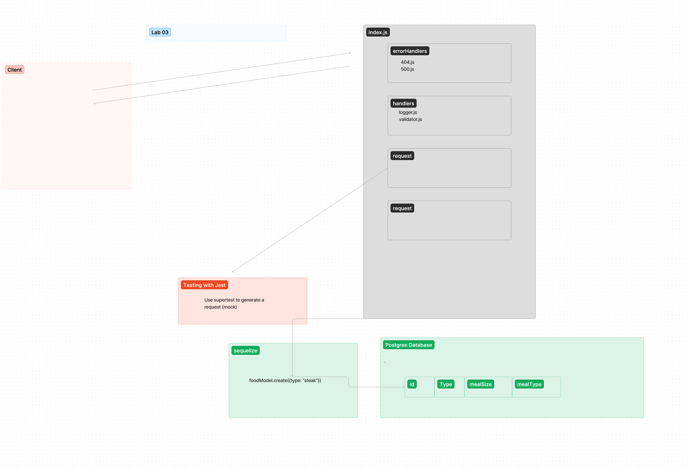

# basic-api-server

## Project: Basic API Server

### Author: Jeremy Cleland

### Problem Domain

API Server for testing

### Links and Resources

- [GitHub Actions ci/cd](https://github.com/jeremy-cleland/basic-api-server/actions)
- Prod [back-end server url](https://basic-api-server-buy3.onrender.com)

### Setup

#### `.env` requirements (where applicable)

#### How to initialize/run your application (where applicable)

- e.g. `npm start`

#### How to use your library (where applicable)

#### Features / Routes

- Feature One: lab 03 Deploy Dev

#### Tests

- How do you run tests?
npm run test-watch
- Any tests of note?
No
- Describe any tests that you did not complete, skipped, etc
N/A

#### UML

